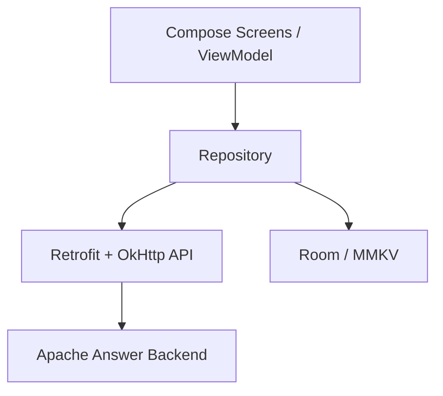

# SIPC TechFlow Android

一个基于 Apache Answer 后端接口构建的原生 Android 客户端，面向 `SIPC TechFlow` 学术问答社区的移动端使用场景。

本项目当前以 [docs/接口文档-入口.md](docs/接口文档-入口.md) 和 [docs/接口文档-详细版.md](docs/接口文档-详细版.md) 作为主要后端接口依据，围绕「提问、浏览、详情、回答、用户主页、标签、个人资料」等核心场景，使用现代 Android 技术栈完成了一套可运行、可扩展、可持续演进的 Compose 客户端。

## 1. 项目定位

这个项目不是一个简单的“Web 包壳”，而是一个基于 Android 原生能力实现的移动端应用：

- 使用 `Jetpack Compose` 构建界面
- 使用 `Retrofit + OkHttp` 访问后端接口
- 使用 `Room` 做本地问题缓存
- 使用 `MMKV` 保存 token、用户会话与轻量 UI 偏好
- 使用 `MVVM + Repository` 保持页面、状态、数据访问职责清晰
- 使用 `单 Activity + 多 Compose Screen` 组织整体导航结构

它的目标是：

- 在移动端提供比网页更顺手的阅读和交互体验
- 保持和现有 Apache Answer 后端兼容
- 为后续扩展通知、搜索、互动、编辑、离线缓存、更多社区能力预留良好结构

## 2. 当前技术栈

### 2.1 UI 层

- `Jetpack Compose`
- `Material 3`
- `Compose Navigation`
- `Coil`

说明：

- 虽然最初技术倾向里提到过 `Navigation3 / ARouter`，但当前项目已经稳定落地的是 `Navigation Compose`
- 这样做的原因是它与当前的 Compose UI 架构耦合更低、接入更直接、维护成本更小
- 如果未来需要切换到别的导航方案，当前页面结构和路由边界也足够清晰，迁移成本可控

### 2.2 数据层

- `Retrofit 2.11.0`
- `OkHttp 4.12.0`
- `Gson`
- `Kotlin Coroutines`
- `Room 2.6.1`
- `MMKV 1.3.5`

### 2.3 Android / 构建层

- `AGP 8.13.0`
- `Kotlin 2.0.21`
- `KSP`
- `JDK 17`
- `minSdk 24`
- `targetSdk 36`

### 2.4 关键依赖版本

依赖统一收敛在 [gradle/libs.versions.toml](gradle/libs.versions.toml) 中管理，便于升级与维护。

## 3. 架构设计

项目采用典型的 `MVVM + Repository + 单 Activity` 架构。

### 3.1 整体分层



### 3.2 分层职责

#### UI 层

位于 `app/src/main/java/com/birliigant/techflow/ui/`

负责：

- 页面渲染
- 用户交互
- 页面状态展示
- 路由跳转

当前主要页面包括：

- `home` 首页问题流
- `detail` 问题详情页
- `ask` 提问页
- `me` 我的页 / 登录页
- `settings` 账号设置页
- `profile` 用户主页
- `explore/tags` 标签页
- `explore/users` 用户页

#### ViewModel 层

ViewModel 与页面一一对应，负责：

- 发起异步请求
- 聚合多个仓库数据
- 管理页面状态
- 屏蔽 UI 对具体接口细节的感知

例如：

- `HomeViewModel`
- `QuestionDetailViewModel`
- `MeViewModel`
- `ProfileViewModel`
- `SettingsViewModel`

#### Repository 层

位于 [Repositories.kt](app/src/main/java/com/birliigant/techflow/data/repository/Repositories.kt)

负责：

- 对接口进行领域级封装
- 管理网络和本地缓存之间的协调
- 输出更适合 UI 消费的数据模型

当前仓库包括：

- `SiteRepository`
- `QuestionRepository`
- `UserRepository`
- `TagRepository`
- `SessionRepository`
- `ConfigRepository`

#### 数据源层

包括两部分：

- 远端：`Retrofit + OkHttp`
- 本地：`Room + MMKV`

职责划分：

- `Room`：保存问题列表缓存，用于网络失败时兜底显示
- `MMKV`：保存 access token、当前用户信息与轻量 UI 偏好状态

### 3.3 为什么这样设计

这样设计的优点是：

- UI 和数据访问解耦
- 页面逻辑更容易测试和替换
- 后端字段变化时，优先只需要修改 network / repository 层
- 随着功能变多，不容易演变成“页面直接请求接口”的混乱结构

## 4. 项目目录说明

```text
app/src/main/java/com/birliigant/techflow
├── MainActivity.kt                  # 单 Activity 入口
├── TechFlowApplication.kt           # Application，初始化 MMKV / AppContainer
├── app/
│   └── AppContainer.kt              # 轻量依赖注入容器
├── core/
│   └── model/Models.kt              # 领域模型定义
├── data/
│   ├── local/QuestionCache.kt       # Room 实体、DAO、Database
│   ├── network/NetworkModels.kt     # DTO / 网络模型 / 映射
│   ├── network/TechFlowApi.kt       # Retrofit API 定义
│   └── repository/Repositories.kt   # Repository 实现
└── ui/
    ├── ask/                         # 提问页
    ├── common/                      # 公共 UI 组件、Markdown 渲染
    ├── detail/                      # 问题详情
    ├── explore/                     # 标签页、用户页
    ├── home/                        # 首页
    ├── me/                          # 我的页 / 登录态
    ├── navigation/                  # 应用导航入口
    ├── profile/                     # 用户主页
    ├── settings/                    # 账号设置
    └── theme/                       # 主题、配色
```

## 5. 当前已实现功能

### 5.1 首页问题流

- 展示问题列表
- 支持多种排序：
  - 最新
  - 活跃
  - 热门
  - 评分
  - 未回答
  - 推荐
- 如果问题已经有最佳回答，首页回答统计会以绿色高亮并显示采纳图标，尽量对齐 Web 端语义
- 支持从首页点击作者进入用户主页
- 支持从首页进入标签页、用户页、我的页

### 5.2 问题详情页

- 展示问题标题、作者、统计信息
- 展示问题正文
- 支持 Markdown / HTML 内容渲染
- 展示回答列表
- 展示评论列表
- 支持点击回答者、评论者、被回复用户进入对应主页

### 5.3 登录与会话

- 支持邮箱密码登录
- 登录后自动刷新当前用户资料
- 进入“我的”或“账号设置”页面时自动刷新用户态
- 支持退出登录

### 5.4 我的页面

- 根据登录态切换内容
- 登录后展示头像、用户名、邮箱、Rank、问题/回答数量
- 提供用户主页、收藏夹、账号设置等入口

### 5.5 用户主页

- 支持查看任意用户主页
- 支持概览 / 回答 / 问题 / 收藏视图
- 展示基础资料、专业、简介、最近内容
- 作为社区内“人物维度”的重要信息入口

### 5.6 账号设置

- 支持编辑并保存：
  - 显示名称
  - 用户名
  - 专业
  - 地区
  - 网站
  - 个人简介
- 当前头像为只读展示

### 5.7 标签与用户发现

- 标签页支持按分区展示标签
- 用户页支持展示社区用户列表
- 所有这些入口都可以从首页和顶部菜单触达

### 5.8 提问

- 支持创建问题
- 支持填写标题、正文、标签、分区等信息

### 5.9 缓存与兜底

- 问题列表会写入 Room
- 当请求问题列表失败时，优先回退到最近一次缓存
- 问题详情在接口异常时，也会尽量从本地缓存构造兜底内容

## 6. 项目特点

### 6.1 不是照搬网页，而是做了移动端适配

项目并没有简单把网页结构硬搬进 App，而是做了几层移动端优化：

- 重要信息优先级重排
- 详情内容支持原生滚动和阅读
- 顶部操作区和用户菜单更适合触屏场景
- 列表和卡片做了更轻量的视觉压缩

### 6.2 对后端字段不稳定有兼容处理

由于现网接口返回并不总是完全严格一致，项目做了较多兼容映射，例如：

- `avatar` 可能是字符串，也可能是对象
- 时间字段可能是 `created_at` 或 `create_time`
- 正文字段可能落在 `content` / `parsed_text` / `html`
- `accepted` 可能是布尔、字符串或数值

这些兼容逻辑集中在 [NetworkModels.kt](app/src/main/java/com/birliigant/techflow/data/network/NetworkModels.kt) 中。

### 6.3 结构轻，但扩展空间大

项目没有引入过重的 DI 框架，而是使用 [AppContainer.kt](app/src/main/java/com/birliigant/techflow/app/AppContainer.kt) 做轻量依赖管理。

这样做的好处是：

- 当前项目体量下更简单直接
- 更适合快速迭代
- 未来如有需要，仍可平滑迁移到 `Hilt / Koin`

### 6.4 本地缓存策略简单但实用

当前缓存只覆盖问题列表和部分详情兜底，但对一个社区类 App 来说已经足以明显改善：

- 弱网下首页空白问题
- 接口偶发失败时的完全不可用问题

## 7. 运行方式

### 7.1 环境要求

- Android Studio 最新稳定版或较新版本
- JDK 17
- Android SDK 36

### 7.2 默认后端地址

项目默认后端地址为：

```text
https://answer.sipc115.com/
```

定义位置见 [Models.kt](app/src/main/java/com/birliigant/techflow/core/model/Models.kt) 中的 `AppDefaults.defaultBaseUrl`。

### 7.3 编译方式

在项目根目录执行：

```bash
./gradlew :app:assembleDebug
```

生成的 APK 默认位于：

```text
app/build/outputs/apk/debug/app-debug.apk
```

## 8. 当前实现与原始需求的关系

项目最初目标技术栈包括：

- UI：Compose
- 数据库：Room
- 网络：OkHttp / Retrofit
- 路由：Navigation3 / ARouter
- 本地存储：MMKV / SP
- 架构：MVVM，单 Activity + 多 Compose 组件

当前落地情况如下：

| 方向 | 当前实现 |
| --- | --- |
| UI | Compose |
| 数据库 | Room |
| 网络 | OkHttp + Retrofit |
| 本地存储 | MMKV |
| 架构 | MVVM + Repository + 单 Activity |
| 路由 | Navigation Compose |

说明：

- `Navigation3 / ARouter` 目前没有接入
- 当前导航层已经足够稳定，未来若有强需求可以替换，但不是现阶段的必要瓶颈

## 9. 已知边界与现状说明

虽然项目已经具备较完整的主流程，但仍有一些边界需要明确：

- 头像上传目前尚未实现写接口接入
- 回答发布、评论发布、点赞、收藏、关注等互动能力还可以继续补齐
- 通知系统页面和消息中心还未完整落地
- 搜索页目前没有做成独立的完整检索体验
- 分区页、通知页、更多个人中心能力仍可进一步丰富

换句话说，当前项目已经是“可使用的 MVP+”，但还没有到“功能完全对齐网页端”的阶段。

## 10. 后续可扩展方向

这个项目的扩展空间很大，比较推荐的演进路线有：

### 10.1 社区互动能力补全

- 发布回答
- 发布评论
- 点赞 / 点踩
- 收藏 / 取消收藏
- 关注标签
- 关注用户

### 10.2 搜索体验增强

- 独立搜索页
- 搜索历史
- 热门搜索
- 多维筛选
- 按标签 / 用户 / 标题 / 内容检索

### 10.3 通知体系

- 收件箱
- 成就提醒
- 红点状态同步
- 已读 / 全部已读
- 推送通知接入

### 10.4 富文本编辑能力

- Markdown 编辑器增强
- 图片上传
- 代码块高亮
- 草稿自动保存
- 本地未提交内容恢复

### 10.5 更完整的离线能力

- 详情缓存
- 用户资料缓存
- 收藏本地镜像
- 增量同步策略

### 10.6 工程化升级

- 引入 `Hilt`
- 增加单元测试 / UI 测试
- 增加 CI
- 增加静态检查
- 拆分 feature module

## 11. 为什么这个项目值得继续做

如果把这个项目继续打磨下去，它会有几个很明显的价值：

- 能成为社区真正可用的 Android 客户端
- 能把原有网页端能力逐步沉淀成更顺手的移动端体验
- 能作为一个完整的 Compose + MVVM + Retrofit + Room 的中型示例项目
- 能为后续更多校园社区 / 问答社区产品提供模板

## 12. 参考文档

- 接口文档：[docs/接口文档.md](docs/接口文档.md)
- 图标资源：[docs/img/logo.svg](docs/img/logo.svg)
- 首页 / UI 参考图：`docs/img/` 目录下相关图片资源

## 13. 总结

`SIPC TechFlow Android` 当前已经具备一个原生社区客户端的基本骨架：

- 有明确的分层
- 有清晰的导航
- 有核心内容流
- 有账户体系
- 有详情阅读
- 有用户主页
- 有设置与资料编辑
- 有本地缓存与接口兼容处理

它已经不是一个“演示工程”，而是一个可以持续迭代的实际项目基础。
